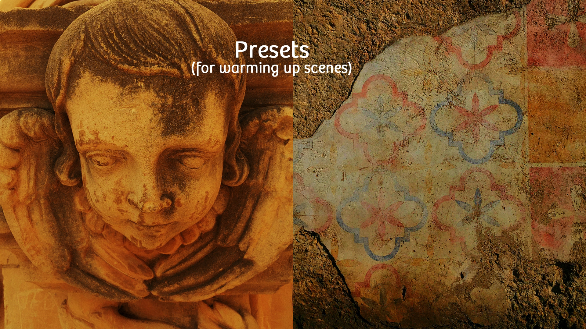

> The basic goal of proper photography is to make your objects and subjects look as natural and neutral as possible. 

## 1. 白平衡
白平衡，字面上的理解是白色的平衡。

在日光灯的房间里拍摄的影像会显得发绿，在室内钨丝灯光下拍摄出来的景物就会偏黄，而在日光阴影处拍摄到的照片则莫名其妙地偏蓝

当一种光线中，三原色成分比例相同，称之为消色，黑、白、灰、金和银所反射的光都是消色。

白平衡就是那个让所有事物在反射到你眼睛和摄像机时，HSV（色度、饱和度、纯度）与事物原本的样子相同的一个衡量标准之一，其中最主要的影响是色温(色度)。

#### 1.1 色温
色温，就是定量地以开尔文温度（K）来表示色彩。

正午阳光直射下的色温约为5600K，阴天更接近室内色温3200K。日出或日落时的色温约为2000K，烛光的色温约为1000K。这时我们不难发现一个规律：色温越高，光色越偏蓝；色温越低则偏红。某一种色光比其它色光的色温高时，说明该色光比其它色光偏蓝，反之则偏红；同样，当一种色光比其它色光偏蓝时说明该色光的色温偏高，反之偏低。

晚霞通红，就是因为其它光在传输到眼前的路上被尘埃挡住了。‘赤、橙、黄、绿、青、蓝、紫’，很明显红色波长较长，携带的温度(能量)较高，‘色温’也较低。其它相反。

#### 1.2 使用情景
其实最好就是自动白平衡不自然就换到情景白平衡、再不自然就换到开儿文轮来手动调整。

#### 1.3 示例
**户外、光线良好 (most outdoor，well-lit scenes)**
:   使用自动白平衡

**阴凉、云层 (shade, cloud cover)**
:   使用情景模式 (preset) ，自动白平衡出现‘偏蓝’或者‘偏冷’

**心中有自己的画面色彩**
:   使用手动模式，根据自己认为最真实的色彩去调节

## 2. 曝光（exposure）
曝光，就是光线通过镜头到达感光器的多少。

光线通过滤镜、光圈、快门、感光元件，生成「图片」，曝光主要因这五个部分影响。

常见的一些快门速度，1/50、1/1000 这里面；ISO，100、200 这些；焦距，f2.2、f2.8 这些。[^2]
这里由一张在不同曝光的情况下，白肤色的人可以变得更加丰富饱满的图片，但是没有图片都是别人的，实在不好意思放在这里。

## 3. 对焦（focus）
目前手机常见的对焦有三种：
- 自动对焦
- 点击屏幕对焦
- 长按屏幕对焦
## 4. 参考
- [white-balance](http://snapsnapsnap.photos/a-beginners-guide-for-manual-controls-in-iphone-photography-white-balance/)
- [exposure](http://snapsnapsnap.photos/a-beginners-guide-for-manual-controls-in-iphone-photography-exposure/)
- [focus](http://snapsnapsnap.photos/a-beginners-guide-for-manual-controls-in-iphone-photography-focus/)
## 5.引用
[^1]: [white-balance](http://snapsnapsnap.photos/a-beginners-guide-for-manual-controls-in-iphone-photography-white-balance/)
[^2]:  [exposure](http://snapsnapsnap.photos/a-beginners-guide-for-manual-controls-in-iphone-photography-exposure/)
[^3]: [focus](http://snapsnapsnap.photos/a-beginners-guide-for-manual-controls-in-iphone-photography-focus/)