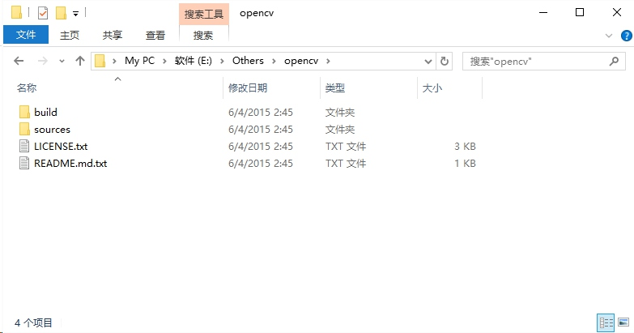

> 入门了手机拍照的基本常识后，技能的提升，主要对摄像的持续性使用就行了。我们来做一些「后期处理」吧。从这章开始使用 OpenCV 来操作图片。

> 注意，从这篇文章开始，必须要先了解基本的 C/C++ 的知识。

##  配置环境
下载 `opencv-3.1.0.exe`[^1] 并安装到 `d:\program\opencv3` 
下载 `vs_community_ENU.exe`[^2] 并安装到安装到默认路径
> 在下载的时候，看『图像编程入门』[^3]这篇入门文章。

## 克隆我的项目
把安装 OpenCV3 的安装文件放成这样的结构：

然后用 Visual Studio Community 2015 打开我提供的 OpenCV 模板项目[^4]，按 F5 可以快速启动项目。
> 当然，自己动手把每一步都配置好，一步一步来，那是最好的，也是以后一定会走的一条路。但是我的经验告诉我，如果是自学，最好是知道目标是什么样，然后自己从头来过，如果有一步错了，可以参考案例代码，快速找到原因。

## 图形基础知识
常见的图片有这几大块：
- 标量图片 - 由像素组成的图片，细节丰富，图像缩放失真。常见表示像素的有 RGB、HSV 等。移动端常见的图片格式有 JPG、PNG、webp 等，都具有有损压缩的特点。
- 矢量图片 - 由曲线组成的图片，细节少，图像缩放清晰。常见表示线段的有 SVG 等。移动端常见的图片格式有 SVG 等。

在标量的图片中，图片由像素组成的矩阵，每个像素如果是 RGB 表示，RGB表示一个像素三原色 红绿蓝，有些可能需要透明度等。

## 熟悉程序运行流程
这一步可以看项目里面用到的每一个函数，里面的每一个注释。同时官方提供的那些例子可以尝试一下自己去运行。然后自己重新做一个这样的东西出来，碰到问题，可以参考样例， 找到为什么出错的原因。

## 开始「后期处理」了
### 给一张图片，添加噪点

## 索引
[^1]: http://opencv.org/
[^2]: https://www.visualstudio.com/
[^3]: [图像编程入门](http://www.ituring.com.cn/tupubarticle/6696)
[^4]: [OpenCV 项目模板](http://github.com/yantze/yantze.github.com/resources/project/opencv3_skeleton.zip)
